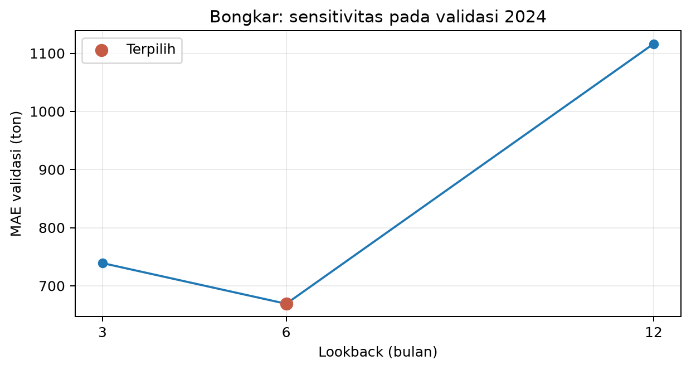
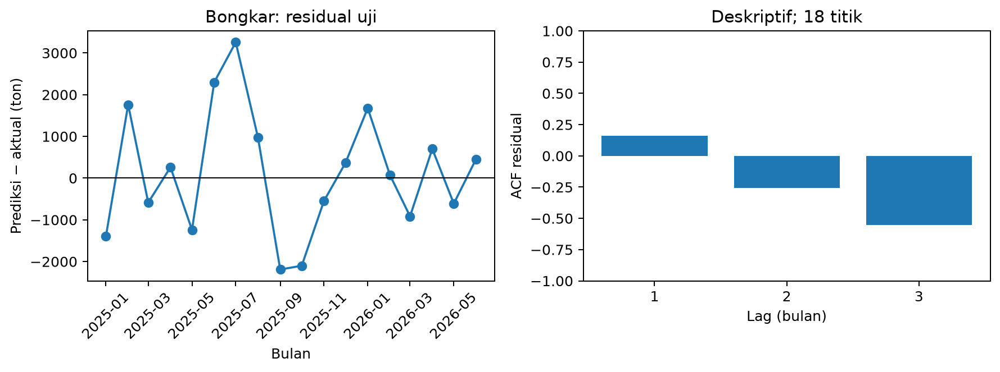
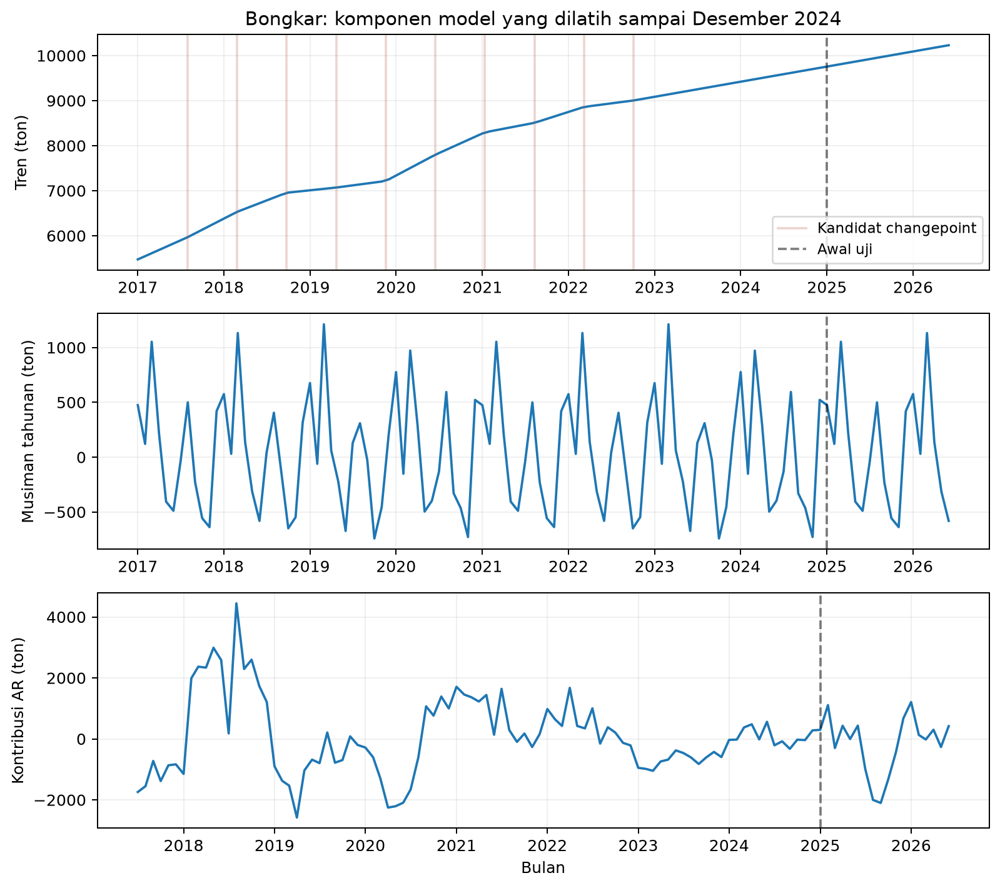
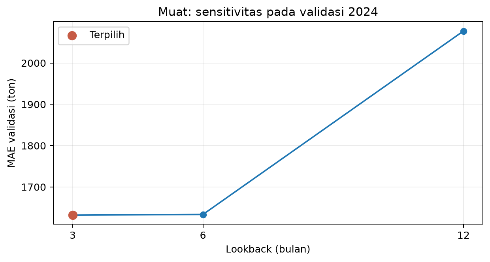
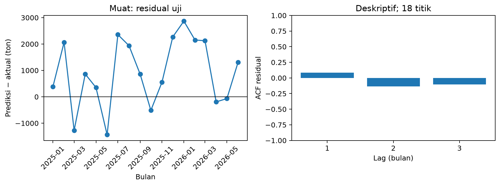
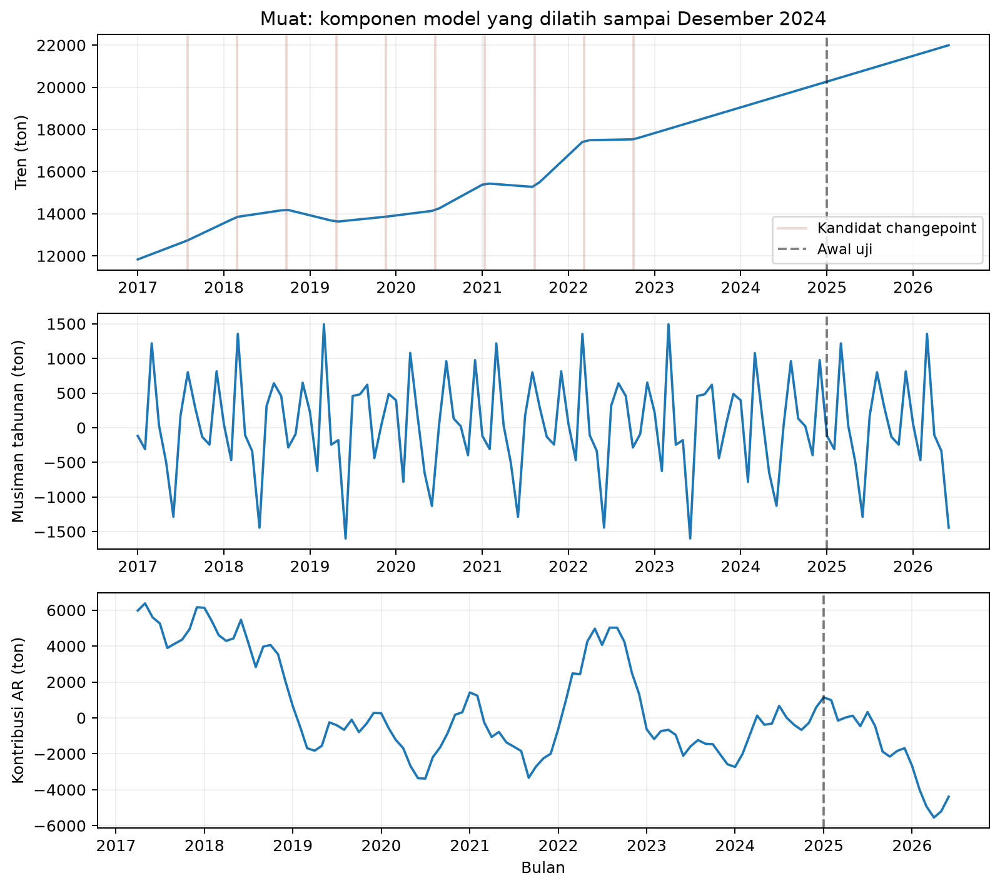
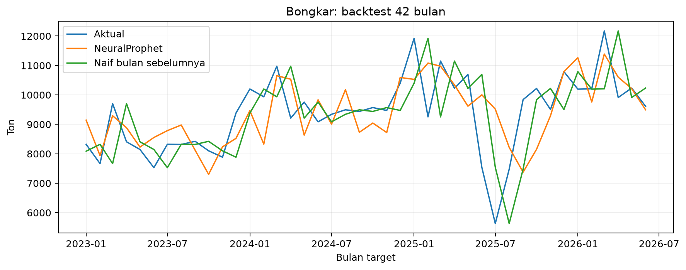
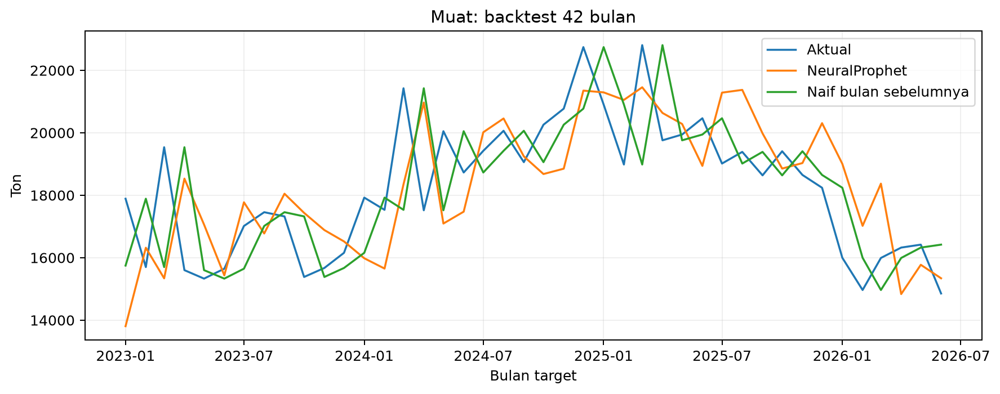

# Pengayaan analisis penelitian

Analisis tambahan ini memakai snapshot 114 bulan Soekarno Hatta-Jakarta. Hasil resmi pada `artifacts/report.json` tetap mengikuti split 84/12/18 dan tidak dipilih ulang dari hasil analisis ini.

## Konfigurasi dan batas tuning

| Parameter | Nilai | Status |
| --- | --- | --- |
| n_lags | 3, 6, 12 | Dipilih berdasarkan MAE validasi; bongkar 6, muat 3 pada eksperimen resmi |
| ar_layers | [] | Tetap; AR linear tanpa hidden layer |
| n_changepoints | 10 | Tetap; lokasi kandidat otomatis |
| epochs | 100 | Tetap |
| learning_rate | 0,01 | Tetap |
| Musiman | Tahunan aktif; mingguan/harian nonaktif | Tetap |
| Seed | 42 | Resmi; lima seed dianalisis terpisah pada konfigurasi resmi |

Pemilihan konfigurasi pada eksperimen ini hanya mencakup lookback. Tidak ada klaim bahwa semua parameter NeuralProphet telah dioptimalkan. Grid besar pada 12 bulan validasi berisiko memilih konfigurasi yang kebetulan cocok. AR-Net nonlinear dan intervensi pandemi tidak ditambahkan agar kompleksitas model tetap sesuai rancangan yang diuji.

## MASE pada 18 bulan uji resmi

MASE = MAE uji / rata-rata |y_t − y_(t−1)| pada data latih Januari 2017–Desember 2024. Penyebut memakai 95 selisih dari 96 bulan; data uji tidak masuk penyebut. [Hyndman dan Koehler (2006)](https://otext.robjhyndman.com/publications/another-look-at-measures-of-forecast-accuracy/).

| Deret | Metode | MAE uji (ton) | MASE | Penyebut (ton) |
| --- | --- | ---: | ---: | ---: |
| Bongkar | NeuralProphet | 1.189,47 | 1,070 | 1.111,40 |
| Bongkar | Bulan sebelumnya | 1.384,56 | 1,246 | 1.111,40 |
| Bongkar | Bulan sama tahun lalu | 1.101,89 | 0,991 | 1.111,40 |
| Muat | NeuralProphet | 1.310,38 | 0,741 | 1.768,59 |
| Muat | Bulan sebelumnya | 1.230,06 | 0,696 | 1.768,59 |
| Muat | Bulan sama tahun lalu | 2.621,94 | 1,483 | 1.768,59 |

NeuralProphet mengungguli naif bulan sebelumnya pada MAE bongkar, tetapi kalah pada muat. Aturan bulan sama tahun lalu juga mengungguli NeuralProphet pada MAE bongkar. MASE < 1 berarti kesalahan lebih kecil daripada skala naif *data latih*; hal itu tidak otomatis berarti mengalahkan naif pada *data uji*.

## Sensitivitas lag, residual, dan komponen

### Bongkar

Model interpretasi mereproduksi prediksi uji resmi dengan selisih maksimum 0,000000 ton. Komponen tahunan rata-rata pada data latih tertinggi di bulan 3 dan terendah di bulan 10. Lag dengan bobot absolut terbesar adalah 1 bulan. Bobot tidak mengukur pengaruh sebab akibat.

| Lag residual | ACF |
| ---: | ---: |
| 1 | 0,162 |
| 2 | -0,256 |
| 3 | -0,552 |

ACF absolut terbesar di antara lag 1–3 berada pada lag 3: -0,552. Nilai ini menggambarkan hubungan dalam sampel galat yang kecil; tidak dijadikan uji signifikansi atau bukti keacakan.

Pada rentang data latih, komponen tren minimum berada pada 2017-01 sebesar 5.473,59 ton dan maksimum pada 2024-12 sebesar 9.727,76 ton. Angka ini adalah komponen yang dipelajari model, bukan minimum/maksimum volume aktual.

| Bulan galat terbesar | Perubahan aktual dari bulan lalu (%) | Galat prediksi (ton) |
| --- | ---: | ---: |
| 2025-07 | -25,34 | 3.257,11 |
| 2025-06 | -29,50 | 2.299,07 |
| 2025-09 | 31,60 | -2.190,60 |

| Lokasi kandidat changepoint | Perubahan kemiringan (ton/bulan nominal) |
| --- | ---: |
| 2017-07-30 | 10,75 |
| 2018-02-25 | -20,26 |
| 2018-09-23 | -44,82 |
| 2019-04-22 | 4,40 |
| 2019-11-18 | 63,36 |
| 2020-06-15 | -12,39 |
| 2021-01-11 | -41,61 |
| 2021-08-10 | 20,75 |
| 2022-03-08 | -30,49 |
| 2022-10-04 | 7,24 |

### Muat

Model interpretasi mereproduksi prediksi uji resmi dengan selisih maksimum 0,000000 ton. Komponen tahunan rata-rata pada data latih tertinggi di bulan 3 dan terendah di bulan 6. Lag dengan bobot absolut terbesar adalah 1 bulan. Bobot tidak mengukur pengaruh sebab akibat.

| Lag residual | ACF |
| ---: | ---: |
| 1 | 0,084 |
| 2 | -0,136 |
| 3 | -0,106 |

ACF absolut terbesar di antara lag 1–3 berada pada lag 2: -0,136. Nilai ini menggambarkan hubungan dalam sampel galat yang kecil; tidak dijadikan uji signifikansi atau bukti keacakan.

Pada rentang data latih, komponen tren minimum berada pada 2017-01 sebesar 11.831,39 ton dan maksimum pada 2024-12 sebesar 20.166,63 ton. Angka ini adalah komponen yang dipelajari model, bukan minimum/maksimum volume aktual.

| Bulan galat terbesar | Perubahan aktual dari bulan lalu (%) | Galat prediksi (ton) |
| --- | ---: | ---: |
| 2026-01 | -12,30 | 2.868,06 |
| 2025-07 | -7,08 | 2.356,91 |
| 2025-12 | -2,20 | 2.268,74 |

| Lokasi kandidat changepoint | Perubahan kemiringan (ton/bulan nominal) |
| --- | ---: |
| 2017-07-30 | 31,92 |
| 2018-02-25 | -111,43 |
| 2018-09-23 | -134,10 |
| 2019-04-22 | 118,03 |
| 2019-11-18 | 8,57 |
| 2020-06-15 | 143,82 |
| 2021-01-11 | -212,48 |
| 2021-08-10 | 346,42 |
| 2022-03-08 | -313,84 |
| 2022-10-04 | 94,83 |

ACF memakai residual yang dipusatkan pada rata-rata; 18 titik membatasi penilaian pola galat. ACF rendah tidak membuktikan galat acak. Kandidat changepoint ditempatkan otomatis dan parameternya tidak membuktikan perubahan struktural yang signifikan. Satu bulan nominal = 365,25/12 hari. Volume aktual tertinggi/terendah berbeda dari kontribusi musiman tertinggi/terendah.

Garis konteks Maret 2020 pada aplikasi merujuk [pernyataan WHO 11 Maret 2020](https://www.who.int/news-room/speeches/item/who-director-general-s-opening-remarks-at-the-media-briefing-on-covid-19---11-march-2020). Tidak ada dummy pandemi atau penghapusan nilai masa pandemi. Penyebab kesalahan 2025–2026 tidak boleh diasumsikan sebagai pandemi.

## Backtest nested walk-forward 42 bulan

Target Januari 2023–Juni 2026. Pada setiap origin, tiga kandidat lag dilatih pada prefix sebelum 12 bulan validasi terakhir. MAE validasi memilih lag; kandidat terpilih kemudian dilatih ulang sampai origin dan memprediksi satu bulan berikutnya. Origin pertama Desember 2022 memiliki train dalam 60 bulan dan validasi Januari–Desember 2022. Sebanyak 336 fit dijalankan offline, dengan seed 42 dan konfigurasi tetap. Checkpoint dapat dilanjutkan; pelatihan tidak dijalankan di Cloud.

| Deret | Metode | MAE 42 bulan (ton) | RMSE (ton) | MAPE (%) |
| --- | --- | ---: | ---: | ---: |
| Bongkar | NeuralProphet | 836,68 | 1.136,52 | 9,66 |
| Bongkar | Bulan sebelumnya | 944,98 | 1.247,26 | 10,37 |
| Muat | NeuralProphet | 1.557,37 | 1.878,61 | 8,65 |
| Muat | Bulan sebelumnya | 1.412,60 | 1.828,48 | 7,71 |

Periode 42 bulan dan model yang diperbarui berbeda dari uji resmi 18 bulan. Metriknya dilaporkan terpisah, tidak dijumlahkan dengan uji resmi dan bukan uji independen kedua. Pemilihan lag setiap origin hanya memakai masa lalu; nilai aktual bulan target dipakai setelah prediksi untuk menghitung error.

Bongkar: lag 3 dipilih 24 kali; lag 6 dipilih 18 kali; lag 12 dipilih 0 kali.

Muat: lag 3 dipilih 24 kali; lag 6 dipilih 17 kali; lag 12 dipilih 1 kali.

## Reproduksi dan penggunaan dalam naskah

Jalankan `python enrich.py`, `python walk_forward.py --workers 4`, lalu `python export_enrichment.py` dari lingkungan Python 3.12. Worker lokal masing-masing memakai satu thread CPU; gunakan `--workers 1` untuk beban lebih kecil. Checkpoint ada di `.tmp/` yang diabaikan Git. Artefak akhir ada di `artifacts/enrichment.json` dan `artifacts/walk_forward.json`; grafik PNG serta tabel CSV ada di `artifacts/figures/`.

BAB II: jelaskan AR linear, MASE, dan prinsip origin bergulir. BAB III: pertahankan prosedur resmi, lalu jelaskan protokol tambahan dan batas data tiap origin. BAB IV: bahas kemenangan/kekalahan terhadap baseline, variasi lag, residual, komponen, serta hasil 42 bulan. BAB V: batasi klaim pada kategori dan periode yang diuji; hindari klaim kausal dari bobot atau changepoint.

SHA-256 laporan resmi: `ceb808f172f90de63350565bb661f29d75a8d9c3b8957fc5900299f8b49b0f7f`. SHA-256 snapshot kanonis: `09efd78fe3c15adf1c05683e38ba54b1c677cc1d3ec0285cf8c2c60eace69131`.

## Pilihan yang tidak ditambahkan

| Usulan | Alasan keputusan |
| --- | --- |
| Grid n_changepoints, epoch, learning rate, dan ar_layers | Validasi resmi 12 bulan; pencarian besar berisiko memilih kecocokan kebetulan. Parameter tetap dilaporkan terbuka. |
| AR-Net dengan hidden layer | Sampel 114 bulan terbatas; AR linear lebih mudah dijelaskan melalui bobot lag. Tidak ada klaim bahwa linear selalu lebih baik. |
| Dummy atau koreksi pandemi | Memerlukan definisi intervensi dan mengubah eksperimen utama; penanda konteks saja tidak menambah variabel model. |
| Lima seed untuk seluruh walk-forward | Memperbesar 336 fit menjadi 1.680 fit. Lima seed pada konfigurasi resmi sudah memberi analisis variasi pelatihan yang terbatas dan jelas. |
| Walk-forward dihitung di Cloud | Beban pelatihan berulang mengganggu respons aplikasi; hasil dihitung offline dan dibaca dari artefak. |
| MASE/backtest mengganti metrik resmi | Protokol dan periode baru dilaporkan sebagai pelengkap agar hasil resmi tetap dapat diaudit. |
